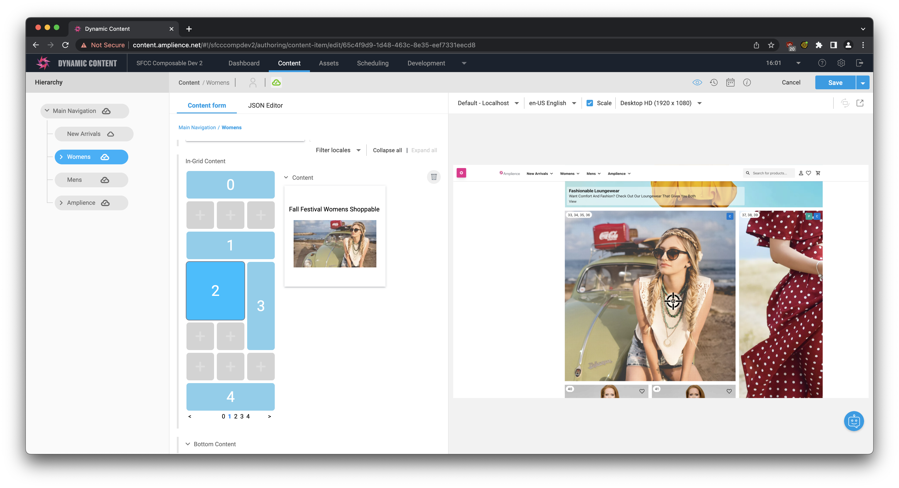

# Dynamic Content Grid Extension

This extension allows users to place and resize grid items using a WYSIWYG editor, and edit their content by selecting them.

## Parameters

Parameters can go on instance or installation, with priority going to instance.

- `cols`: The number of columns on the grid. (default: 3)
- `pageSize`: The number of items on a page. (default: 24)
- `paginated`: Whether the grid is paginated or not. (default: true)
- `pageCount`: The number of pages content can be placed on. (default: 100)
- `mode`: The type of positioning that the grid items use. (default: absolute)
  - `absolute`: Position indices are always equivalent to the same position on the grid: `pageBase + (y * cols) + x`. Useful for layouts with only grid content, or for implementing custom wrapping logic.
  - `wrap`: Grid items consume `rows*cols` spaces directly after their position, and positions for surrounding spaces flow from left to right, up to down. Useful for placing items that need other content to wrap around them.
- `contentTypes`: Content type information for the editor to display links and references. A list of objects with the following properties:
  - `id`: The schema ID of the content type.
  - `icon`: The URL of an icon to use for displaying the content type.
  - `card`: The templatized URL of a card to use for displaying the content type.

If you want to get started after cloning this repo, remember to sync packages with `npm i`.

## How to install

### Register Extension

This extension needs to be [registered](https://amplience.com/docs/development/registeringextensions.html) against a Hub with in the Dynamic Content application (Developer -> Extensions), for it to load within that Hub.

#### Setup

* Category: Content Field
* Label: Grid _(this will appear as the tab title in the Dashboard)_
* Name: grid _(needs to be unique with the Hub)_
* URL: [https://dc-extension-grid.vercel.app/](https://dc-extension-grid.vercel.app/)
* Description: Grid Layout Extension _(can be left blank, if you wish)_

Note:
You can use our deployed version of this extension (builds from the "production" branch) -

[https://dc-extension-grid.vercel.app/](https://dc-extension-grid.vercel.app/)

_As this is an open source project you're welcome to host your own "fork" of this project. You can use any standard static hosting service (Netlify, Amplify, Vercel, etc.) if you wish._

##### Permissions

Sandbox permissions:
- Allow same origin (required to load font)

## Output Data Format & Usage

The grid extension manages an array of objects with the following properties:

- `position`: The position of this item on the grid, absolute or wrapped based on the extension parameter. (see above)
- `cols`: How many columns this item spans. (width)
- `rows`: How many rows this item spans. (height)

Any other properties in the object are exposed via the content field editor that appears when you select a content item.

## Available Scripts

In the project directory, you can run:

### `HTTPS=true npm start`

Runs the app in the development mode.\
Open [https://localhost:3000](https://localhost:3000) to view it in your browser.

The page will reload when you make changes.\
You may also see any lint errors in the console.